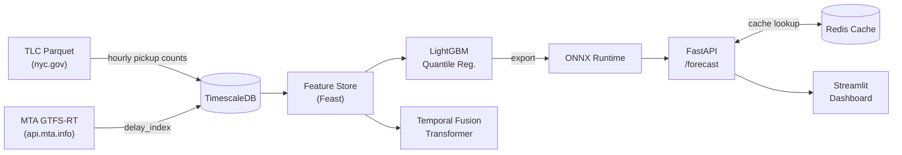

# Pulsecast

[](https://github.com/olveirap/pulsecast/actions/workflows/ci.yml)

**Probabilistic shipment demand forecasting** using NYC TLC trip records and
live MTA GTFS-Realtime congestion signals.

Pulsecast produces p10/p50/p90 hourly demand forecasts per TLC zone for
horizons of 1–7 days, served at low latency via a FastAPI endpoint backed by
ONNX Runtime and a Redis cache.

---

## Architecture



---

## Repository Layout

```
pulsecast/
├── data/
│   ├── ingest/
│   │   ├── tlc.py              # Downloads TLC Yellow/Green Parquet files
│   │   ├── gtfs_rt.py          # Polls MTA GTFS-RT, computes delay_index
│   │   └── gtfs_rt_backfill.py # Backfills delay_index from S3 archives
│   └── schema.sql              # TimescaleDB hypertable definitions
├── features/
│   ├── demand.py           # Lags, rolling means, EWM trend, YoY ratio
│   ├── calendar.py         # dow, hour, week, holiday, event flag
│   └── congestion.py       # lag-1 delay_index, rolling-3h, disruption_flag
├── models/
│   ├── baseline.py         # MSTL + AutoARIMA (statsforecast)
│   ├── lgbm.py             # LightGBM quantile regression + CV
│   ├── tft.py              # Temporal Fusion Transformer (pytorch-forecasting)
│   └── export.py           # ONNX export with parity validation
├── serving/
│   ├── main.py             # FastAPI POST /forecast
│   ├── cache.py            # Redis cache (delay_index bucketing)
│   └── schemas.py          # Pydantic v2 models
├── dashboard/
│   └── app.py              # Streamlit fan chart + ablation panel
├── docker-compose.yml      # api, gtfs-poller, redis, timescaledb, mlflow
├── Makefile                # ingest / backfill / features / train / export / serve / test
├── pyproject.toml          # Python ≥3.12 dependencies
├── ARCHITECTURE.md         # Data flow and component responsibilities
├── DECISIONS.md            # ADRs: GTFS-RT covariate, ONNX, cache bucketing
├── RESULTS.md              # Ablation table (placeholder)
├── CITATION.md             # NYC TLC and MTA attribution
└── LICENSE                 # MIT
```

---

## Quickstart

### Prerequisites

- Docker ≥ 24 and Docker Compose ≥ 2.20
- Python ≥ 3.12 (for local development)
- An MTA API key (free — register at <https://api.mta.info/>)

### 1. Clone and configure

```bash
git clone https://github.com/olveirap/pulsecast.git
cd pulsecast
cp .env.example .env          # edit MTA_API_KEY in .env
```

### 2. Start services

```bash
make up
# or: docker compose up --build -d
```

This starts TimescaleDB, Redis, MLflow, the GTFS-RT poller, and the API.

### 3. Ingest TLC data

```bash
make ingest
```

Downloads the last 24 months of Yellow and Green taxi Parquet files and
aggregates them to hourly pickup counts per zone.

### 4. Backfill historical GTFS-RT delay index

The live GTFS-RT poller only captures data from the moment it starts running.
To train models that use the `delay_index` congestion covariate, ~18 months of
historical data must be backfilled from the MTA GTFS-RT protobuf archives
stored in S3.

#### S3 access pattern

Archives are stored in the public bucket `s3://mta-gtfs-rt-archives` under the
key layout:

```
s3://mta-gtfs-rt-archives/{YYYY}/{MM}/{DD}/{HH}/gtfs_rt.pb
```

The backfill script uses **boto3** with the standard AWS credential chain
(environment variables → `~/.aws/credentials` → IAM role).  No special
permissions beyond `s3:GetObject` and `s3:ListBucket` on the bucket are
required.

Relevant environment variables:

| Variable           | Default                   | Description                           |
|--------------------|---------------------------|---------------------------------------|
| `BACKFILL_BUCKET`  | `mta-gtfs-rt-archives`    | S3 bucket name                        |
| `BACKFILL_PREFIX`  | *(empty)*                 | Optional key prefix within the bucket |
| `AWS_REGION`       | `us-east-1`               | AWS region                            |
| `AWS_PROFILE`      | *(default profile)*       | Named AWS credential profile          |

#### Running the backfill

```bash
# Default: last 18 months up to today
make backfill

# Custom date range
make backfill BACKFILL_START=2023-01-01 BACKFILL_END=2024-06-30

# Or invoke directly for finer control
python -m data.ingest.gtfs_rt_backfill \
    --start 2023-01-01 \
    --end   2024-06-30 \
    --profile my-aws-profile

# Dry-run: parse and log rows without writing to the database
python -m data.ingest.gtfs_rt_backfill \
    --start 2024-01-01 \
    --end   2024-01-07 \
    --dry-run
```

### Build stop-to-zone mapping (required for GTFS-RT coverage)

`delay_index` aggregation depends on a complete GTFS stop-to-TLC zone mapping
stored at `pulsecast/data/stop_to_zone.csv`.

Regenerate it with:

```bash
make build-stop-zone-map
# or: python scripts/build_stop_zone_map.py
```

The script downloads MTA GTFS static `stops.txt` and TLC taxi zone polygons,
spatially joins stop coordinates to zone polygons, and writes the CSV used at
runtime by `pulsecast.data.ingest.gtfs_rt`.

### 5. Train models

```bash
make train
```

### 6. Export to ONNX

```bash
make export
```

### 7. Run the API

```bash
make serve
# → http://localhost:8000
```

Example request:

```bash
curl -s -X POST http://localhost:8000/forecast \
  -H "Content-Type: application/json" \
  -d '{"route_id": 132, "horizon": 3}' | jq .
```

```json
{
  "route_id": 132,
  "horizon": 3,
  "p10": [42.1, 39.8, ...],
  "p50": [58.3, 55.1, ...],
  "p90": [75.6, 72.4, ...]
}
```

### 8. Launch the dashboard

```bash
make dashboard
# → http://localhost:8501
```

---

## Results

| Model | MAE | RMSE | Pinball p10 | Pinball p50 | Pinball p90 |
|---|---|---|---|---|---|
| MSTL (baseline) | — | — | — | — | — |
| LightGBM | — | — | — | — | — |
| LightGBM + delay_index | — | — | — | — | — |
| TFT + delay_index | — | — | — | — | — |

See [RESULTS.md](RESULTS.md) for the full evaluation protocol.

---

## Licence

MIT — see [LICENSE](LICENSE).

Data attributions: [CITATION.md](CITATION.md).

