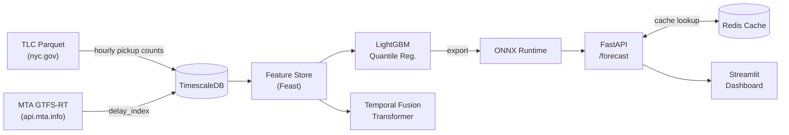

# Pulsecast

**Probabilistic shipment demand forecasting** using NYC TLC trip records and
live MTA GTFS-Realtime congestion signals.

Pulsecast produces p10/p50/p90 hourly demand forecasts per TLC zone for
horizons of 1–7 days, served at low latency via a FastAPI endpoint backed by
ONNX Runtime and a Redis cache.

---

## Architecture



---

## Repository Layout

```
pulsecast/
├── data/
│   ├── ingest/
│   │   ├── tlc.py          # Downloads TLC Yellow/Green Parquet files
│   │   └── gtfs_rt.py      # Polls MTA GTFS-RT, computes delay_index
│   └── schema.sql          # TimescaleDB hypertable definitions
├── features/
│   ├── demand.py           # Lags, rolling means, EWM trend, YoY ratio
│   ├── calendar.py         # dow, hour, week, holiday, event flag
│   └── congestion.py       # lag-1 delay_index, rolling-3h, disruption_flag
├── models/
│   ├── baseline.py         # MSTL + AutoARIMA (statsforecast)
│   ├── lgbm.py             # LightGBM quantile regression + CV
│   ├── tft.py              # Temporal Fusion Transformer (pytorch-forecasting)
│   └── export.py           # ONNX export with parity validation
├── serving/
│   ├── main.py             # FastAPI POST /forecast
│   ├── cache.py            # Redis cache (delay_index bucketing)
│   └── schemas.py          # Pydantic v2 models
├── dashboard/
│   └── app.py              # Streamlit fan chart + ablation panel
├── docker-compose.yml      # api, gtfs-poller, redis, timescaledb, mlflow
├── Makefile                # ingest / features / train / export / serve / test
├── pyproject.toml          # Python ≥3.11 dependencies
├── ARCHITECTURE.md         # Data flow and component responsibilities
├── DECISIONS.md            # ADRs: GTFS-RT covariate, ONNX, cache bucketing
├── RESULTS.md              # Ablation table (placeholder)
├── CITATION.md             # NYC TLC and MTA attribution
└── LICENSE                 # MIT
```

---

## Quickstart

### Prerequisites

- Docker ≥ 24 and Docker Compose ≥ 2.20
- Python ≥ 3.11 (for local development)
- An MTA API key (free — register at <https://api.mta.info/>)

### 1. Clone and configure

```bash
git clone https://github.com/olveirap/pulsecast.git
cd pulsecast
cp .env.example .env          # edit MTA_API_KEY in .env
```

### 2. Start services

```bash
make up
# or: docker compose up --build -d
```

This starts TimescaleDB, Redis, MLflow, the GTFS-RT poller, and the API.

### 3. Ingest TLC data

```bash
make ingest
```

Downloads the last 24 months of Yellow and Green taxi Parquet files and
aggregates them to hourly pickup counts per zone.

### 4. Train models

```bash
make train
```

### 5. Export to ONNX

```bash
make export
```

### 6. Run the API

```bash
make serve
# → http://localhost:8000
```

Example request:

```bash
curl -s -X POST http://localhost:8000/forecast \
  -H "Content-Type: application/json" \
  -d '{"route_id": 132, "horizon": 3}' | jq .
```

```json
{
  "route_id": 132,
  "horizon": 3,
  "p10": [42.1, 39.8, ...],
  "p50": [58.3, 55.1, ...],
  "p90": [75.6, 72.4, ...]
}
```

### 7. Launch the dashboard

```bash
make dashboard
# → http://localhost:8501
```

---

## Results

| Model | MAE | RMSE | Pinball p10 | Pinball p50 | Pinball p90 |
|---|---|---|---|---|---|
| MSTL (baseline) | — | — | — | — | — |
| LightGBM | — | — | — | — | — |
| LightGBM + delay_index | — | — | — | — | — |
| TFT + delay_index | — | — | — | — | — |

See [RESULTS.md](RESULTS.md) for the full evaluation protocol.

---

## Licence

MIT — see [LICENSE](LICENSE).

Data attributions: [CITATION.md](CITATION.md).

