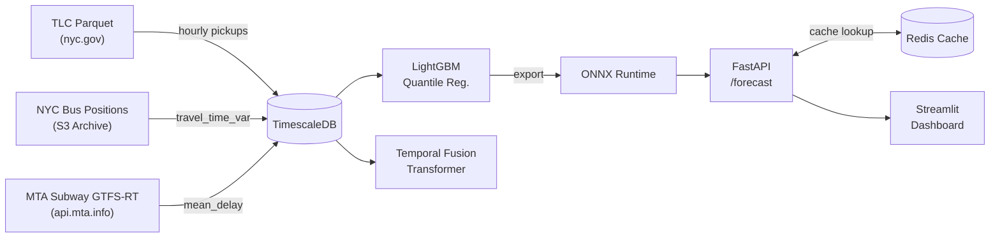

# Pulsecast

[](https://github.com/olveirap/pulsecast/actions/workflows/ci.yml)

**Probabilistic shipment demand forecasting** using NYC TLC trip records, NYC bus
positions, and live MTA subway GTFS-Realtime signals.

Pulsecast produces p10/p50/p90 hourly demand forecasts per TLC zone for
horizons of 1–7 days, served at low latency via a FastAPI endpoint backed by
ONNX Runtime and a Redis cache.

---

## Architecture



---

## Repository Layout

```
pulsecast/
├── data/
│   ├── ingest/
│   │   ├── tlc.py                    # Downloads TLC Yellow/Green Parquet files
│   │   ├── bus_positions.py          # S3 bus positions -> travel_time_var
│   │   ├── bus_positions_backfill.py # Historical S3 bus positions backfill
│   │   └── subway_rt.py              # Polls 8 MTA Subway feeds -> mean_delay
│   └── schema.sql                    # TimescaleDB hypertable definitions
├── features/
│   ├── demand.py                 # Lags, rolling means, EWM trend, YoY ratio
│   ├── calendar.py               # dow, hour, week, holiday, event flag
│   └── congestion.py             # travel_time_var lags, rolling-3h, flags
├── models/
│   ├── baseline.py               # MSTL + AutoARIMA (statsforecast)
│   ├── lgbm.py                   # LightGBM quantile regression + CV
│   ├── tft.py                    # Temporal Fusion Transformer (pytorch-forecasting)
│   └── export.py                 # ONNX export with parity validation
├── serving/
│   ├── main.py                   # FastAPI POST /forecast
│   ├── cache.py                  # Redis cache (travel_time_var bucketing)
│   └── schemas.py                # Pydantic v2 models
├── dashboard/
│   └── app.py                    # Streamlit fan chart + ablation panel
├── docker-compose.yml            # api, gtfs-poller, redis, timescaledb, mlflow
├── Makefile                      # ingest / backfill / features / train / export / serve / test
├── pyproject.toml                # Python ≥3.12 dependencies
├── ARCHITECTURE.md               # Data flow and component responsibilities
├── DECISIONS.md                  # ADRs: Bus variance covariate, ONNX, cache
├── RESULTS.md                    # Ablation table (placeholder)
├── CITATION.md                   # NYC TLC, Bus Positions, and MTA attribution
└── LICENSE                       # MIT
```

---

## Quickstart

### Prerequisites

- Docker ≥ 24 and Docker Compose ≥ 2.20
- Python ≥ 3.12 (for local development)
- An MTA API key (free — register at <https://api.mta.info/>)

### 1. Clone and configure

```bash
git clone https://github.com/olveirap/pulsecast.git
cd pulsecast
cp .env.example .env          # edit MTA_API_KEY in .env
```

### 2. Start services

```bash
make up
# or: docker compose up --build -d
```

### 3. Ingest TLC data

```bash
make ingest-tlc
```

### 4. Backfill historical bus positions

To train models that use the congestion covariate, ~18 months of historical
data must be backfilled from the NYC Bus Positions archive stored in S3.

#### S3 access pattern

Archives are stored in the public bucket `s3://nycbuspositions` under the
key layout:

```
s3://nycbuspositions/{YYYY}/{MM}/{YYYY}-{MM}-{DD}-bus-positions.csv.xz
```

#### Running the backfill

```bash
# Default: last 18 months up to today
make backfill

# Custom date range
make backfill BACKFILL_START=2023-01-01 BACKFILL_END=2024-06-30
```

### Build spatial mappings

Mapping bus positions and subway stops to TLC taxi zones is required.

Regenerate them with:

```bash
make build-zone-maps
```

---

## Licence

MIT — see [LICENSE](LICENSE).

Data attributions: [CITATION.md](CITATION.md).
